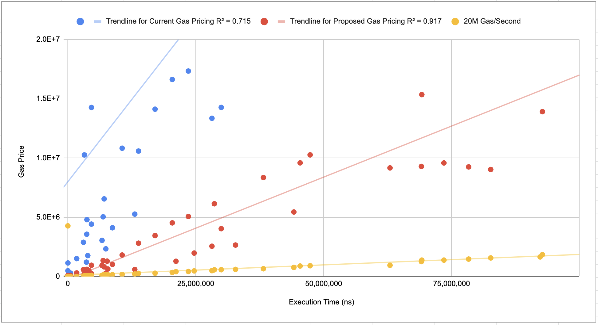
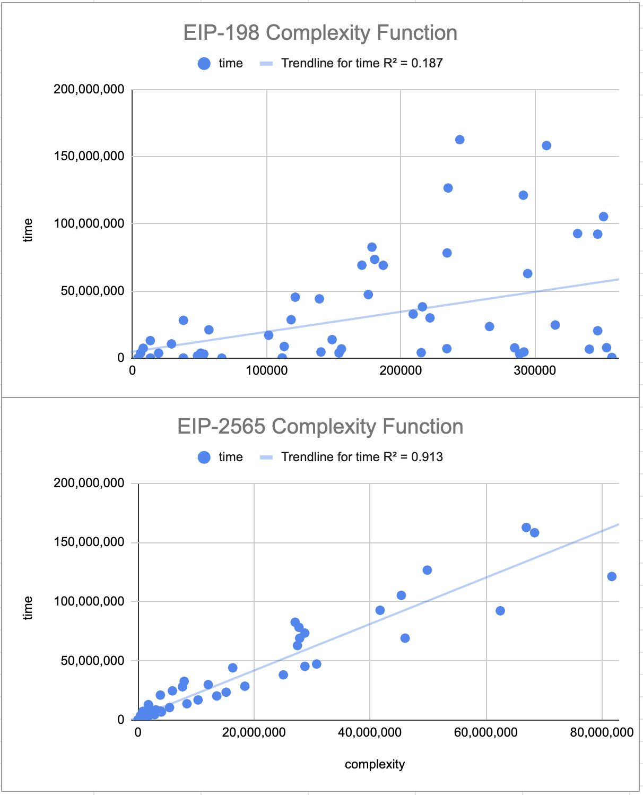

## Simple Summary
The [EIP-198](https://eips.ethereum.org/EIPS/eip-198) ‘big integer modular exponentiation’, or `ModExp`, precompile is currently overpriced. Re-pricing this precompile will enable more cost efficient verification of RSA signatures, verifiable delay functions (VDFs), primality checks, and more.

## Abstract
After benchmarking the ModExp precompile, we discovered that it is ‘overpriced’ relative to other precompiles. We also discovered that the current gas pricing formula could be improved to better estimate the computational complexity of various ModExp input variables. To improve the gas cost pricing for this precompile the following options are available:

1. Changing the value of the `GQUADDIVISOR` parameter in the ModExp pricing formula to bring its costs more in-line with other precompiles
2. Modifying the gas pricing formula to better reflect the computational complexity of ModExp operations
3. Improving the underlying libraries beneath the ModExp Precompile
4. Any combination of (1), (2), and (3)

We recommend **Option (1)** which provides a large practical improvement to gas estimation while keeping implementation complexity low. Options (2) and (3) could also be implemented and would further improve the gas pricing for a broader range of use cases. Additional data can be provided for options (2) and (3) as desired.

## Motivation
Modular exponentiation is a foundational arithmetic operation for many cryptographic functions including signatures, VDFs, SNARKs, accumulators, and more. Unfortunately, the ModExp precompile is currently over-priced, making these operations inefficient and expensive. By reducing the cost of this precompile, these cryptographic functions become more practical, enabling improved security, stronger randomness (VDFs), and more.

## Specification
The current gas pricing formula is defined in EIP-198. This formula divides a ‘computational complexity’ function by a ‘gas conversion’ parameter called `GQUADDIVISOR` to arrive at a gas cost. 

### **Recommended** Option (1): Change value of GQUADDIVISOR
`GQUADDIVISOR` is set to ‘20’ per EIP-198. We recommend changing the value of this parameter to ‘200’.

### Option (2): Modify ‘computational complexity’ function 
The current complexity function, as defined in EIP-198 is as follow:

```
def mult_complexity(x):
    if x <= 64: return x ** 2
    elif x <= 1024: return x ** 2 // 4 + 96 * x - 3072
    else: return x ** 2 // 16 + 480 * x - 199680
```
where is `x` is `max(length_of_MODULUS, length_of_BASE)`

This complexity formula was meant to approximate the difficulty of Karatsuba multiplication. However, we found a better approximation for modelling modular exponentiation. We recommend the following formula to better estimate the computational complexity for varying input values:

```
def mult_complexity(x):
    ceiling(x/64)^2
```
where is `x` is `max(length_of_MODULUS, length_of_BASE)`. `x` is divided by 64 to account for the number of limbs in multiprecision arithmetic.

You can find comparison of these two complexity fomulas for the current test vector as the following [spreadsheet](https://docs.google.com/spreadsheets/d/1Fq3d3wUjGN0R_FX-VPj7TKhCK33ac--P4QXB9MPQ8iw/edit?usp=sharing).

### Option (3): Replace libraries used by ModExp precompiles
ModExp benchmarks for different libraries can be found at the following [spreadsheet](https://docs.google.com/spreadsheets/d/1Fq3d3wUjGN0R_FX-VPj7TKhCK33ac--P4QXB9MPQ8iw/edit?usp=sharing).

While alternative libraries can provide improved performance, this option is not recommended at this time.

## Rationale

### **Recommended** Option (1): Change value of GQUADDIVISOR:
Changing the value of this parameter from 20 to 200 will reduce the gas cost of this precompile by a factor of 10 with minimal implementation changes. With this change, the cost of the ModExp precompile will have a higher cost (gas/second) than other precompiles such as ECRecover.



### Option (2): Modify ‘computational complexity’ formula
An alternative ‘complexity’ function can be found at the following [spreadsheet](https://docs.google.com/spreadsheets/d/1Fq3d3wUjGN0R_FX-VPj7TKhCK33ac--P4QXB9MPQ8iw/edit?usp=sharing).



The new complexity function has a better fit vs. the execution time when compared to the current complexity function. This better fit is because the new complexity formula accounts for the use of binary exponentiation algorithms that are used by ‘bigint’ libraries for large exponents. You may also notice the regression line of the proposed complexity function bisects the test vector data points. This is because the run time varies depending on if the modulus is even or odd.

While modifying the computational complexity formula can improve gas estimation at a medium implementation cost, we do not recommend it at this time.

### Option (3): Improving the ModExp precompile implementations


Replacing the underlying library can improve the performance of the ModExp precompile by 2x-4x for large exponents, but comes at a high implementation cost. We do not recommend this option at this time.

## Test Cases
There are no changes to the underlying interface or arithmetic algorithms, so the existing test vectors can be reused. Gas values will need to be updated in the existing unit tests based on the final pricing decided in this EIP. This will ensure that the updated gas calculations are done correctly.

## Security Considerations
The biggest security consideration for this EIP is creating a potential DOS vector by making ModExp operations too inexpensive relative to their computation time. Once a gas pricing formula is finalized in this EIP, we will run an analysis to ensure that a DOS vector is not created. This can be done by assuming all the gas in the block is used for this pre-compile for the worst-case input values. 

## References
[EIP-198](https://eips.ethereum.org/EIPS/eip-198) 

## Copyright
Copyright and related rights waived via [CC0](https://creativecommons.org/publicdomain/zero/1.0/).
